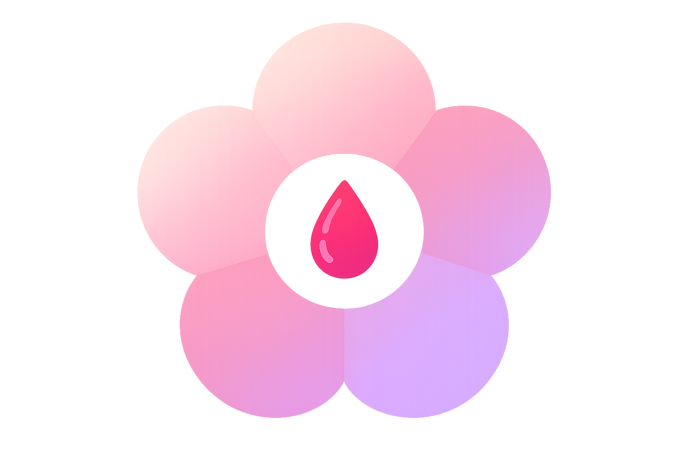

<div align="center">



# Ovella

**Platform Kesehatan Hormonal Perempuan Berbasis AI**

*AI-Powered Women's Hormonal Health Platform for Indonesia*

[](https://react.dev)
[](https://www.typescriptlang.org)
[](https://vite.dev)
[](https://tailwindcss.com)
[](https://www.figma.com/make)

[Lihat Desain Figma](https://www.figma.com/design/S6VM26mOb7CZOVugTzY1HC/Ovella) · [Demo Langsung](#) · [Laporan Bug](#) · [Request Fitur](#)

---

</div>

## 📖 Tentang Ovella

Ovella adalah prototipe aplikasi mobile kesehatan hormonal perempuan yang dibangun untuk pasar Indonesia. Berbeda dari aplikasi period tracker konvensional yang hanya mengandalkan rata-rata populasi, Ovella membangun **Hormonal Fingerprint™** — model AI unik per pengguna yang belajar dari data individual secara longitudinal.

Aplikasi ini dirancang untuk menjawab kesenjangan nyata: jutaan perempuan Indonesia mengalami kondisi hormonal seperti PCOS, endometriosis, dan jerawat hormonal, namun tidak memiliki akses ke pemantauan yang personal, kontekstual, dan terhubung ke tenaga medis.

> **Status:** UI/UX Prototype — dibangun menggunakan Figma Make sebagai proof-of-concept interaktif berbasis React.

---

## ✨ Fitur Utama

### 🤖 AI Features
| Fitur | Deskripsi |
|-------|-----------|
| **Ovella AI Chat** | Chatbot berbasis NLP yang menjawab pertanyaan hormonal dalam Bahasa Indonesia, kontekstual terhadap fase siklus pengguna |
| **Hormonal Fingerprint™** | Radar chart AI yang memetakan 6 dimensi profil hormonal unik pengguna (akurasi prediksi, konsistensi siklus, pola mood, dll.) |
| **Hormonal Weather™** | Prediksi 7-hari ke depan untuk energi, mood, subur, fokus, dan kualitas tidur berbasis pola siklus historis |
| **Luteal Intelligence™** | Dashboard cerdas fase luteal — memprediksi onset gejala PMS dan menyusun rencana perawatan proaktif |
| **Hormonal Twin™** | Mencocokkan pengguna dengan profil hormonal serupa dari komunitas anonim untuk berbagi tips yang relevan |
| **Doctor Report AI** | Membuat laporan klinik terstruktur (PDF-ready) dari data longitudinal pengguna, siap dibawa ke konsultasi dokter |

### 📱 Core Features
- **Cycle Tracker** — Kalender menstruasi visual dengan kode warna per fase (menstruasi, folikular, ovulasi, luteal)
- **Daily Log Entry** — Pencatatan harian: gejala fisik, mood, energi, kondisi kulit, kualitas tidur, catatan bebas
- **Reports Dashboard** — Visualisasi tren panjang siklus, heatmap frekuensi gejala, pola mood per fase
- **Doctor Hub** — Manajemen koneksi ke dokter, riwayat laporan yang dikirim, dan inbox
- **Premium Upgrade Flow** — Sistem freemium dengan fitur terkunci dan trial 7 hari gratis
- **Notification Center** — Pengingat cerdas berbasis fase siklus dan update dari AI

---

## 🗂️ Struktur Proyek

```
ovella/
├── src/
│   ├── app/
│   │   ├── components/
│   │   │   ├── ui/                     # shadcn/ui base components (40+ komponen)
│   │   │   ├── figma/                  # Figma Make utilities
│   │   │   │
│   │   │   ├── Splash.tsx              # Splash screen
│   │   │   ├── Onboarding.tsx          # 3-slide onboarding flow
│   │   │   ├── ProfileSetup.tsx        # Health profile setup (2 steps)
│   │   │   ├── Login.tsx               # Login screen
│   │   │   ├── Register.tsx            # Registration screen
│   │   │   │
│   │   │   ├── MainLayout.tsx          # Bottom tab navigation wrapper
│   │   │   ├── Home.tsx                # Dashboard utama & Hormonal Weather hero
│   │   │   ├── CycleTracker.tsx        # Kalender siklus interaktif
│   │   │   ├── DailyLogEntry.tsx       # Form pencatatan harian (bottom sheet)
│   │   │   ├── AIHub.tsx               # Pusat fitur AI
│   │   │   ├── Reports.tsx             # Dashboard laporan & grafik
│   │   │   ├── Profile.tsx             # Profil pengguna & pengaturan
│   │   │   │
│   │   │   ├── AIChat.tsx              # Ovella AI Chat (NLP chatbot)
│   │   │   ├── HormonalFingerprint.tsx # Hormonal Fingerprint™ radar chart
│   │   │   ├── HormonalForecast.tsx    # Hormonal Weather™ 7-day forecast
│   │   │   ├── LutealDashboard.tsx     # Luteal Intelligence™ dashboard
│   │   │   ├── TwinMatch.tsx           # Hormonal Twin™ matching
│   │   │   │
│   │   │   ├── DoctorReportGeneration.tsx  # Alur pembuatan laporan AI
│   │   │   ├── DoctorReportPreview.tsx     # Preview & share laporan klinik
│   │   │   ├── DoctorHub.tsx               # Manajemen koneksi dokter
│   │   │   ├── AddDoctor.tsx               # Form tambah dokter
│   │   │   ├── DoctorInbox.tsx             # Inbox laporan (sisi dokter)
│   │   │   ├── ReportSent.tsx              # Konfirmasi pengiriman laporan
│   │   │   │
│   │   │   ├── PremiumUpgrade.tsx      # Flow upgrade Premium + upsell
│   │   │   ├── NotificationCenter.tsx  # Pusat notifikasi
│   │   │   ├── ReminderSettings.tsx    # Pengaturan pengingat
│   │   │   ├── FirstAnomaly.tsx        # Modal deteksi anomali pertama
│   │   │   ├── PrivacySecurity.tsx     # Privasi & keamanan data
│   │   │   └── HeaderActions.tsx       # Reusable header actions component
│   │   │
│   │   └── routes.tsx                  # React Router konfigurasi (28 routes)
│   │
│   ├── styles/
│   │   ├── theme.css                   # CSS variables & design tokens
│   │   ├── tailwind.css                # Tailwind directives
│   │   ├── globals.css                 # Global styles
│   │   ├── index.css                   # Entry styles
│   │   └── fonts.css                   # Font declarations
│   │
│   ├── imports/
│   │   ├── pasted_text/                # Figma Make context documents
│   │   └── *.png                       # Aset gambar (logo, ilustrasi)
│   │
│   └── main.tsx                        # React entry point
│
├── guidelines/
│   └── Guidelines.md                   # Figma Make AI guidelines
│
├── index.html                          # HTML entry point
├── package.json                        # Dependencies & scripts
├── vite.config.ts                      # Vite + Tailwind + Figma asset config
├── postcss.config.mjs                  # PostCSS config
├── ATTRIBUTIONS.md                     # Lisensi pihak ketiga
└── README.md                           # You are here
```

---

## 🗺️ Routing

Semua 28 routes terdefinisi di `src/app/routes.tsx`:

| Path | Komponen | Deskripsi |
|------|----------|-----------|
| `/` | `Splash` | Splash screen |
| `/login` | `Login` | Login |
| `/register` | `Register` | Registrasi akun baru |
| `/onboarding` | `Onboarding` | 3-slide onboarding |
| `/setup` | `ProfileSetup` | Setup profil kesehatan |
| `/app` | `MainLayout` | Wrapper navigasi utama |
| `/app` (index) | `Home` | Dashboard utama |
| `/app/cycle` | `CycleTracker` | Pelacak siklus |
| `/app/ai` | `AIHub` | Pusat fitur AI |
| `/app/reports` | `Reports` | Laporan & analitik |
| `/app/profile` | `Profile` | Profil & pengaturan |
| `/ai-chat` | `AIChat` | Ovella AI Chat |
| `/fingerprint` | `HormonalFingerprint` | Hormonal Fingerprint™ |
| `/forecast` | `HormonalForecast` | Hormonal Weather™ |
| `/twin-match` | `TwinMatch` | Hormonal Twin™ |
| `/luteal-dashboard` | `LutealDashboard` | Luteal Intelligence™ |
| `/doctor-report-gen` | `DoctorReportGeneration` | Generate laporan dokter |
| `/doctor-report` | `DoctorReportPreview` | Preview laporan klinik |
| `/premium` | `PremiumUpgrade` | Upgrade ke Premium |
| `/notifications` | `NotificationCenter` | Pusat notifikasi |
| `/reminder-settings` | `ReminderSettings` | Pengaturan pengingat |
| `/doctor-hub` | `DoctorHub` | Manajemen dokter |
| `/add-doctor` | `AddDoctor` | Tambah dokter |
| `/report-sent` | `ReportSent` | Konfirmasi laporan terkirim |
| `/privacy` | `PrivacySecurity` | Privasi & keamanan |
| `/inbox` | `DoctorInbox` | Inbox dokter |

---

## 🎨 Design System

Ovella menggunakan sistem desain yang bersumber dari identitas logo:

### Palet Warna
```css
/* Brand Colors */
--pink-primary:    #FF6B9D;
--lavender-primary: #C4A8F5;
--hot-pink-accent:  #FF2D78;
--deep-blush:       #F9A8C9;

/* Gradients */
--gradient-main:   linear-gradient(135deg, #FF6B9D, #C4A8F5);
--gradient-sunset: linear-gradient(135deg, #FF2D78, #FF6B9D, #C4A8F5);

/* Cycle Phase Colors */
--menstruasi: #FF2D78;
--folikular:  #FF6B9D;
--ovulasi:    gradient-main;
--luteal:     #C4A8F5;
```

### Tipografi
- **Font utama:** SF Pro Display / `-apple-system`
- **Heading:** Bold, 22–34px, tracking negatif
- **Body:** Regular, 15–17px
- **Caption:** Regular, 11–13px

### Komponen UI
Dibangun di atas [shadcn/ui](https://ui.shadcn.com/) dengan 40+ komponen Radix UI primitif, dikustomisasi dengan design token Ovella. Komponen-komponen tersedia di `src/app/components/ui/`.

---

## 🚀 Memulai

### Prasyarat

- **Node.js** v18 atau lebih baru
- **npm** v9+ (atau **pnpm** — lihat catatan di bawah)

### Instalasi

```bash
# Clone repository
git clone https://github.com/username/ovella.git
cd ovella

# Install dependencies
npm install

# Jalankan development server
npm run dev
```

Buka [http://localhost:5173](http://localhost:5173) di browser.

### Scripts

```bash
npm run dev      # Development server dengan HMR
npm run build    # Build untuk produksi (output: dist/)
```

### Catatan pnpm

Proyek ini menyertakan konfigurasi `pnpm.overrides` di `package.json`. Jika menggunakan pnpm:

```bash
pnpm install
pnpm dev
```

---

## 📦 Tech Stack

### Core
| Package | Versi | Kegunaan |
|---------|-------|----------|
| React | 18.3.1 | UI framework |
| TypeScript | 5.x | Type safety |
| Vite | 6.3.5 | Build tool & dev server |
| React Router | 7.13.0 | Client-side routing |
| Tailwind CSS | 4.1.12 | Utility-first styling |

### UI Components
| Package | Versi | Kegunaan |
|---------|-------|----------|
| shadcn/ui (Radix UI) | Various | Headless UI primitives |
| MUI Material | 7.3.5 | Komponen tambahan |
| Lucide React | 0.487.0 | Icon library |
| Motion | 12.23.24 | Animasi |

### Data & Charts
| Package | Versi | Kegunaan |
|---------|-------|----------|
| Recharts | 2.15.2 | Grafik & visualisasi data |
| React Hook Form | 7.55.0 | Form management |
| date-fns | 3.6.0 | Utilitas tanggal |

### UX Enhancements
| Package | Versi | Kegunaan |
|---------|-------|----------|
| React Day Picker | 8.10.1 | Calendar picker |
| Embla Carousel | 8.6.0 | Carousel/swipe gestures |
| Sonner | 2.0.3 | Toast notifications |
| Vaul | 1.1.2 | Drawer / bottom sheet |
| Canvas Confetti | 1.9.4 | Celebration animations |

---

## 🏗️ Arsitektur Prototipe

Ini adalah **UI prototype** — seluruh data bersifat statis/mock. Tidak ada backend atau API terintegrasi.

```
Pengguna → React SPA → Komponen UI → State Lokal (useState/mock data)
```

Untuk pengembangan production selanjutnya, arsitektur yang direkomendasikan:

```
Mobile App (React Native / Flutter)
    ↓
API Gateway
    ↓
Services:
├── Auth Service (JWT)
├── User Health Profile Service
├── Cycle Logging Service
├── AI/ML Service
│   ├── Time-series model (LSTM) — Hormonal Fingerprint™
│   ├── NLP Model — Ovella AI Chat
│   ├── Anomaly Detection
│   └── Recommendation Engine
├── Report Generation Service (PDF)
└── Notification Service
    ↓
Database (PostgreSQL + TimescaleDB untuk time-series)
```

---

## 🤝 Kontribusi

Kontribusi sangat disambut! Ini adalah proyek open prototype — silakan fork dan kembangkan.

```bash
# 1. Fork repository ini
# 2. Buat branch baru
git checkout -b fitur/nama-fitur-baru

# 3. Commit perubahan
git commit -m "feat: tambah fitur X"

# 4. Push ke branch
git push origin fitur/nama-fitur-baru

# 5. Buka Pull Request
```

### Konvensi Commit

Gunakan [Conventional Commits](https://www.conventionalcommits.org/):
- `feat:` — Fitur baru
- `fix:` — Bug fix
- `design:` — Perubahan UI/UX
- `refactor:` — Refaktor kode
- `docs:` — Perubahan dokumentasi
- `chore:` — Maintenance

---

## 📄 Lisensi & Atribusi

Proyek ini dibangun menggunakan:

- **[shadcn/ui](https://ui.shadcn.com/)** — MIT License
- **[Unsplash](https://unsplash.com)** — Unsplash License
- **[Figma Make](https://www.figma.com/make)** — Platform pembuatan prototipe

Lihat [ATTRIBUTIONS.md](./ATTRIBUTIONS.md) untuk detail lengkap.

---

<div align="center">

Dibuat dengan 💗 untuk kesehatan hormonal perempuan Indonesia

**Ovella** - *Kenali dirimu dari dalam.*

</div>
